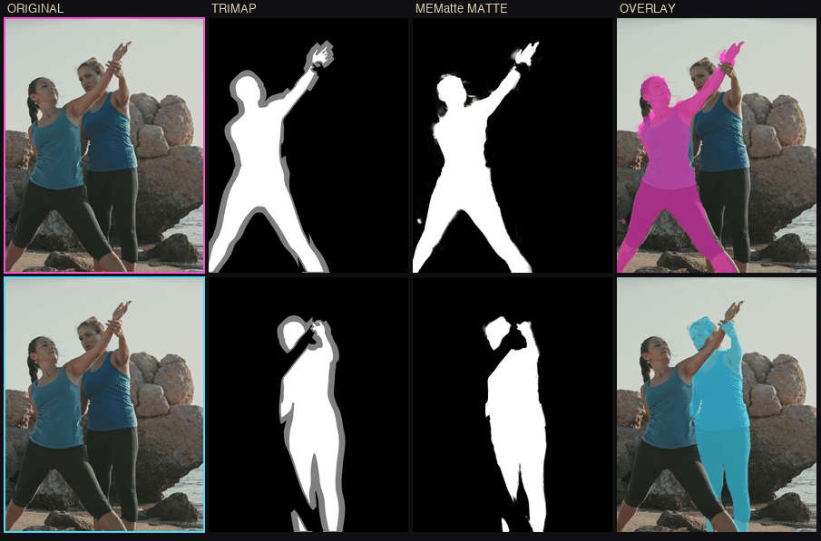

# Hypnos — MEMatte OpenFX plugin

<p align="center">
  
</p>

<p align="center"><em>Source plate, trimap, extracted matte, and the matte overlaid back on the plate.</em></p>

A hardware-accelerated **OpenFX** plugin that extracts an **alpha matte** from an image and a
trimap using **[MEMatte](https://github.com/linyiheng123/MEMatte)** (AAAI 2025), run through
**ONNX Runtime** — the **CoreML** execution provider on Apple Silicon and the **CUDA** provider on
Linux and Windows (NVIDIA), with automatic CPU fallback.

- **Inputs:** an RGB(A) plate (assumed **ACEScg**, linear AP1, by default) and a **Trimap**.
- **Output:** a same-resolution matte — single channel by default, or RGBA with the matte
  attached, premultiplied or not.
- **Memory:** bounded by a **token cap**, not by throwing away resolution. Free VRAM is measured
  before the session is created, and an out-of-memory condition degrades gracefully instead of
  failing the render.

> **Status: working end-to-end on all three platforms.** Both MEMatte variants export to ONNX and
> produce mattes through the plugin in headless Natron on macOS (Apple Silicon), Linux/CUDA
> (RTX A6000) and Windows 11/CUDA (RTX 3090) — numerically matching across all three. A 4K matte
> takes 2.6 s and 6.9 GB of VRAM. The memory model is calibrated against measured VRAM.
> See [Status](#status) for what is proven and what is not.

This project reuses the cross-platform OFX + ONNX Runtime scaffolding proven in
[humbaba](https://github.com/samhodge-tokgan/humbaba) (Depth Anything 3), including its bundle
layout, private-runtime isolation and host-compatibility workarounds.

## Why the token cap matters

Matting is a *detail* task: the value is in hair and soft edges. The usual way to fit a big plate
into limited memory — infer at a lower resolution and scale the result back up — destroys exactly
the detail you wanted. MEMatte's contribution is a router that sends only the most informative
tokens through global attention and the rest through a lightweight module, so the quadratic cost
is bounded **at full resolution**.

This plugin exposes that cap directly, and only falls back to reducing resolution when the
measured free memory cannot fit the plate even at the minimum cap — and says so when it does.

```
ACEScg RGBA + Trimap
   └─▶ ACEScg → sRGB (AP1→Rec.709 + sRGB transfer); trimap decoded to 0 / 0.5 / 1
        └─▶ ImageNet normalise, concat trimap as channel 3, pad to a multiple of 32
             └─▶ backbone ONNX (token cap = runtime input) → features at 1/16
                  └─▶ decoder ONNX over 512 px tiles + 64 px halo → alpha
                       └─▶ crop, composite against the full-res trimap
                            └─▶ matte / RGBA (premultiplied or not)
```

## Trimap encoding — and why mid grey stops being a problem

A trimap is data travelling through an image pipeline, so the same "mid grey" pixel can arrive as
`0.5` (float data), `0.50196` (8-bit 128/255), or `0.21404` (8-bit 128 sRGB-decoded to linear, which
is what happens in an ACEScg comp). Judging that by eye is genuinely hard.

The default **Auto** mode sidesteps it entirely: it only classifies **near-black → background** and
**near-white → foreground**, and calls *everything else* unknown. Mid grey never has to be
recognised, so all three encodings give the same result. Unknown is also the safe default — it
means "let the model decide" rather than forcing a wrong hard edge.

Explicit modes (`Float 0 / 0.5 / 1`, `Integer 0 / 128 / 255` — upstream's own `<85` / `>=170` rule —
and `sRGB mid grey`) are available when you want exact, documented behaviour. Scene-referred
super-white still reads as foreground rather than being clipped into the unknown band.
`tests/trimap_test.cpp` pins all of this down.

## Resource control

| Control | Effect |
|---|---|
| **Max tokens** | MEMatte's global-attention cap. The primary lever: bounds memory at **full resolution**, so it costs no matte detail. |
| **Auto from available memory** | Measures free VRAM (NVML, falling back to cudart) or system RAM, subtracts headroom, and caps the tokens to fit. |
| **Memory budget (MB)** | A fixed budget instead, when Auto is off. |
| **Memory headroom (%)** | Left for the host application and other processes. Raise it if the host competes for VRAM. |
| **Device** | Auto / GPU / CPU. **CPU is a legitimate workaround** when the GPU is small or busy — correct, just slower, and not limited by VRAM. |

On top of the plan, the engine keeps a **retry ladder**: if ONNX Runtime still reports an
allocation failure it halves the token cap, then reduces the processing resolution, then rebuilds
the session on CPU — reporting each step rather than failing the render. The budget also becomes
the CUDA provider's `gpu_mem_limit` with `arena_extend_strategy = kSameAsRequested`, so the arena
cannot quietly over-reserve. On Apple Silicon there is no VRAM byte-cap API (unified memory), so
the token cap and resolution are the levers there — the same limitation humbaba documents.

## Building

Requires CMake ≥ 3.20 and a C++17 compiler. The OpenFX SDK and the correct per-platform ONNX
Runtime are fetched automatically.

```sh
# macOS (Apple clang, CoreML) — arm64, as ORT's CoreML build requires
cmake -S . -B build -DHYP_WITH_ONNX=ON -DCMAKE_BUILD_TYPE=Release
cmake --build build -j

# Linux — build on EL8 (Rocky 8 + gcc-toolset-12, or manylinux_2_28), NOT on a
# newer distro: the VFX Reference Platform baseline is glibc 2.28, and a binary
# built on Ubuntu 24.04 will not load there. Needs patchelf.
source /opt/rh/gcc-toolset-12/enable
cmake -S . -B build -DHYP_WITH_ONNX=ON -DCMAKE_BUILD_TYPE=Release
cmake --build build -j"$(nproc)"
tools/check_el8_abi.sh build/MEMatte.ofx.bundle/Contents/Linux-x86-64/MEMatte.ofx

# Windows (MSVC / Visual Studio 2022, static-CRT CUDA ORT)
cmake -S . -B build -G "Visual Studio 17 2022" -A x64 -DHYP_WITH_ONNX=ON
cmake --build build --config Release --parallel
```

The result is `build/MEMatte.ofx.bundle`, laid out per the OFX spec
(`Contents/{MacOS,Linux-x86-64,Win64}`). `cmake --build build --target install-local` installs it.

Run the unit tests with `ctest` (from `build/`) and the export-design tests with:

```sh
python3 tools/routing_equivalence_test.py
python3 tools/shape_dynamics_test.py
```

## Models and their licensing

**This project does not redistribute model weights, deliberately.** MEMatte licenses its *code*
as MIT and says nothing about its checkpoints; those checkpoints
(`MEMatte_ViT{S,B}_DIM.pth`) are trained on the **Adobe Deep Image Matting / Composition-1k**
dataset and fine-tuned from ViTMatte's Composition-1k weights, and Adobe's dataset agreement
restricts models trained on it to **non-commercial** use and distribution. Shipping them from an
Apache-2.0 repo aimed at commercial hosts would misrepresent those terms, so the release
artifacts contain no `.onnx` files and `tools/fetch_models.*` has no default URL.

Export them yourself instead, having accepted the upstream terms — about a minute per variant:

```sh
git clone https://github.com/linyiheng123/MEMatte
pip install -r tools/requirements.txt
pip install 'git+https://github.com/facebookresearch/detectron2.git'

python3 tools/export_mematte.py --mematte-repo ../MEMatte \
    --checkpoint ../MEMatte/checkpoints/MEMatte_ViTS_DIM.pth \
    --variant s --out-dir build/models
```

The plugin looks for `mematte_<s|b>_{backbone,decoder}.onnx` in the *Backbone/Decoder file*
parameters, then `$MEMATTE_MODEL_DIR`, then the bundle's `Contents/Resources`.

If your facility mirrors the exported models internally, `tools/fetch_models.sh --base-url ...`
(or `-BaseUrl` on Windows) will pull them from there, with optional SHA-256 verification.

## Status

### Verified end-to-end (macOS 26, Apple Silicon, Natron 2.6 headless)

- **Both variants export and match PyTorch.** `tools/export_mematte.py` produces
  `mematte_{s,b}_{backbone,decoder}.onnx` from the upstream checkpoints. ONNX-vs-PyTorch alpha
  agrees to **3.8e-5** across four (resolution, token cap) combinations the graphs were never
  traced with — including 320×448 and 640×384 at caps of 1024 and 65536.
- **The plugin produces real mattes.** Discovered in Natron with both `Source` and `Trimap`
  inputs; a Read → MEMatte → Write render gives **MAE 0.0018** (ViT-S) and **0.0019** (ViT-B)
  against a synthetic ground truth, with 23.7% genuinely soft pixels and the trimap's known
  regions forced exactly to 0 and 1. All three output modes render, and the host honours the
  declared premultiplication state.
- **The token cap does what it claims.** At 512×512 (1024 tokens), `K=256` runs in 442 ms versus
  ~900 ms uncapped, and any `K ≥ N` gives bit-identical output — the cap saturates correctly
  rather than silently changing results.
- **The routing rewrite is equivalent.** Checked against a transcription of upstream's own eval
  path across every regime: differences are `0.0` in most cases, never above `3e-7`.
- **One graph serves every resolution**, confirmed at six unseen resolutions.
- **Bundle isolation is correct**: exactly two exported symbols and a privately-named ONNX Runtime.
- The sizing estimator lands within ~8% of MEMatte's published 0.71 GB (ViT-S) and ~1% of
  1.49 GB (ViT-B) at 1024².

### Verified on Linux + CUDA

Two distros, because the ABI floor matters: **Rocky Linux 8.10** (glibc 2.28 — the VFX Reference
Platform baseline, RTX 3090) for the shipped artifact, and **Ubuntu 24.04** (RTX A6000 48 GB,
driver 570) for the performance numbers. The Rocky-built binary loads and renders on both;
`tools/check_el8_abi.sh` and CI keep it that way.

- **Cross-platform numerical parity.** The same plate gives `max|Linux − macOS| = 4.9e-4`,
  `MAE = 1.3e-6`, mean alpha 0.219111 vs 0.219110.
- **Speed.** The ViT-S backbone at 512² runs in **12.8 ms** on CUDA versus 858 ms on macOS CPU.
  A full **4K (3840×2160) matte renders in 2.6 s using 6.9 GB** of VRAM, at MAE 0.0003.
- **The token cap is the memory lever it claims to be.** ViT-S at 2048²:

  | token cap | VRAM | time |
  |---|---|---|
  | 1024 | **1.3 GB** | 111 ms |
  | 4096 | 2.3 GB | 131 ms |
  | 16384 | 35.3 GB | 651 ms |

  27× the memory and 5.9× the time, at identical resolution.
- **The auto budget works.** On a 4K plate it lowered the cap to 12590 to fit the measured free
  VRAM, and said so.
- **The degradation ladder works.** Forcing small budgets: 8000 MB → cap lowered to 5091;
  3000 MB → cap *and* resolution reduced; 1200 MB → 608 px long side. All rendered, none failed.
  The resolution step is visibly worse (MAE 0.0019 vs 0.0003), which is exactly why it is last.
- **NVML probing works** against real hardware (43.8/48.0 GB free).

### Verified on Windows 11 + CUDA (build 26200, RTX 3090, MSVC 14.44, Natron 2.6)

- **Three-platform numerical parity.** Windows mean alpha 0.219110 vs Linux 0.219111 vs macOS
  0.219110; `max|diff| = 4.9e-4`, `MAE ~1e-6`. All three score MAE 0.0018 against ground truth.
- **Both Windows-specific hazards are closed and measured** — see [`docs/WINDOWS.md`](docs/WINDOWS.md):
  - The bundled ORT is renamed `onnxruntime_hyp.dll` and reached through a delay-load hook, so the
    loader can never bind us to Windows ML's System32 `onnxruntime.dll`. Confirmed by `dumpbin`,
    and confirmed in practice by loading **alongside humbaba's `DepthAnything3` bundle in the same
    Natron process**, each with its own ORT.
  - Hosts ship their own VC++ runtime, and **Nuke 16.1v3 ships MSVCP140 14.36** here (System32 has
    14.44) — the mismatch that broke humbaba. The `.ofx` previously imported 38 MSVCP140 symbols;
    it is now linked against the static CRT and depends on **only `KERNEL32.dll` and the
    delay-loaded `onnxruntime.dll`**.
- **VRAM parity:** 789 MB on Windows/RTX 3090 vs 799 MB on Linux/A6000 for the same job, so the
  sizing model carries over.

### Measured limitation: CoreML and the dynamic token cap

CoreML's MIL compiler **rejects the backbone outright** — the runtime token cap leaves the
TopK/Gather dimensions unbounded, and it reports `has unbounded dimension which is not supported`.
ONNX Runtime falls back partition by partition, which is *slower than not offering CoreML at all*:

| graph | CPU | CoreML offered |
|---|---|---|
| backbone (dynamic K) | **858 ms** | 2923 ms |
| decoder (plain convs) | 546 ms | **259 ms** |

So the engine now picks the execution provider **per graph**: backbone on CPU, decoder on CoreML.
That took the host render from 0.2 to 0.5 fps and cut the error spam from ~17 messages to 4. The
4 that remain come from the decoder's dynamic tile height/width; fixed-size decoder tiles would
remove them, and static-K preset exports remain the fallback if full CoreML coverage is wanted.

This is CoreML-specific — CUDA handles dynamic shapes natively — but it is unmeasured on CUDA.

### A bug worth knowing about

An out-of-memory error that the engine does not *recognise* fails silently: the retry ladder gives
up on the first attempt and the plugin falls through to passthrough, writing the source image into
the matte output. It looks like a successful render.

That shipped broken. A capped CUDA arena reports

```
BFCArena::AllocateRawInternal ... Available memory of 189612800 is smaller than
requested bytes of 221179904
```

which matched none of the obvious "out of memory" spellings, so a 4K matte silently became a
passthrough — MAE 0.23 instead of 0.0015. Fixed, and pinned by `tests/oom_test.cpp` using the
verbatim string. When adding patterns there, err towards false positives: one costs a wasted
retry, the other costs a silently wrong render.

### Not yet done

- **The colour/trimap matrix check is not done properly.** Natron's reader does not honour the
  identity-OCIO trick `tests/natron/render_matte.py` attempts, so the plugin receives
  host-transformed values. Matte quality is unaffected, but proving that ACEScg EXR and 8-bit sRGB
  inputs agree needs a harness that controls colour management properly.
- **No model weights are published** — see [Models and their licensing](#models-and-their-licensing).
  You must export them yourself.
- **Nuke has never loaded the plugin.** Nuke 16.1v3 is installed on the Windows machine but its
  RLM licence server was unreachable, so this is unverified. The CRT analysis above is a strong
  proxy — there is no longer a CRT dependency to conflict with — but not a substitute.
- **Resolve, Fusion and Flame are untested.**
- The memory model is calibrated for CUDA only; macOS unified memory is still unfitted.
- No `models-v1` release exists yet, so `tools/fetch_models.*` have no pinned checksums.

## Licences

This plugin is **Apache-2.0** (see [`LICENSE`](LICENSE)).

It runs **MEMatte** (MIT), and the ONNX export tooling here is a **derivative work** of MEMatte's
source — `tools/mematte_routing.py` in particular transcribes and rewrites its inference routing.
Release artifacts bundle **ONNX Runtime** (MIT) and redistribute no model weights.

[`NOTICE`](NOTICE) sets out exactly which files derive from which upstream, and how to cite the
MEMatte paper.
